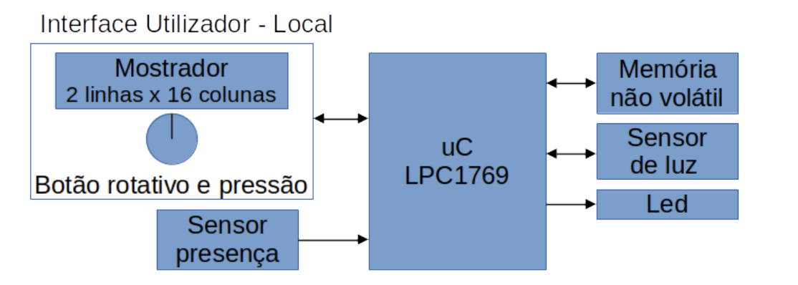

# Embedded Systems Project – LPC1769 (2022)

## 🎯 Objective

This project was developed for the **Embedded Systems** course and aims to implement an **autonomous lighting control system** based on **occupancy detection** and **ambient light levels**.

---

## 🛠️ Architecture

The system is based on the **NXP LPCXpresso LPC1769** development board, featuring the **LPC1769 microcontroller**. The following components are integrated:

- 🕹️ **User Interface**: Rotary encoder with push-button functionality  
- 📟 **LCD Display**: MC1602C (2x16 characters), controlled via HD44780  
- 👀 **Motion Sensor**: AM312 (PIR-based)  
- 💡 **Light Sensor**: BH1750  
- 💾 **EEPROM**: 128 Kb non-volatile memory with SPI interface  
- 💡 **LED**: Represents the controlled lighting output

---

## ⚙️ Operation

The system operates autonomously and supports two main modes:

### ✅ Normal Mode

- Automatically turns on the light when **motion is detected** and the **ambient light level is below** the configured threshold.
- Events are stored in non-volatile memory (with timestamp and light value).
- Pressing the button shows **date, time, and light level** on the LCD for 5 seconds; the LCD stays off otherwise.

### 🛠️ Maintenance Mode

Activated via **double-click** of the button. This mode allows:

- Setting the **minimum light threshold**
- Adjusting the **date and time**
- Viewing the **detection logs**

#### In this mode:

- 🔄 The **rotary encoder** navigates through menus  
- ✅ The **push-button** selects or confirms menu items  

##### While setting date/time:

- The rotary encoder **increases/decreases** the selected field  
- The button moves to the **next field** or confirms input when on the last one

##### While setting the light threshold:

- The encoder adjusts the value  
- The button confirms the selection and returns to the menu

##### While viewing logs:

- The encoder scrolls through previous/next entries  
- The button exits the log view and returns to the menu

All configurations and detection events are stored in EEPROM.

---

## 📷 System Block Diagram

